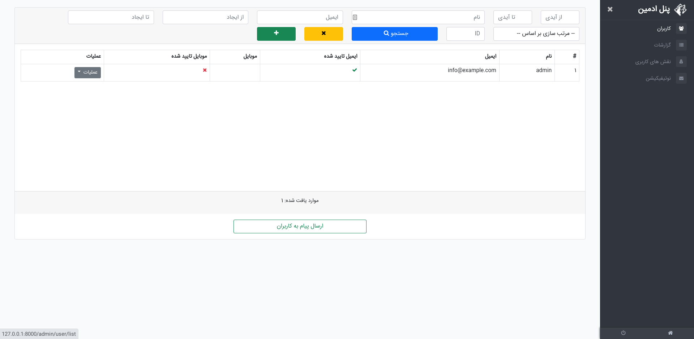

# Laravel Admin Panel

This is a boilerplate for a simple Laravel admin panel using Boostrap5.
You can clone this project to have and login and register form with admin panel and ACL permissions check.
Also, you have iranian sms providers and gateways by default.



## Installation

```
composer install

npm install
```

if  you are using cpanel:
```
cp .htaccess.example .htaccess
```

Setup your database information in .env file

```
php artisan migrate

php artisan db:seed
```

## Production Setup

### Queue
you must add queue to supervisor for notifications

https://laravel.com/docs/8.x/queues#supervisor-configuration

### Redis
You need to install that in production for better experience with cache and add details in .env file.
if you don't have redis, you can use 'file' for CACHE_DRIVER

## Development

### composer.locks
please don't commit your local version to git , (it breaks composer if you use higher version on your local machine)

### env Variables
please don't use env variable. because we use artisan optimize command it doesn't get value from .env file.

you must put this env variables in app/config directory

### Versioning
Don't commit anything in git without merge request.

### Front End
if you need to add a custom css or custom js code you must add it into style or script section in blade page.

if you need to add new style that must run on every page you can add it into _custom.scss file in resources directory.

if you need to add new script that must run on every page you can add it into custom.js file in resources directory.

after that you must run:

```
npm run prod
```

#### Dont commit any css or js library in public folder.
if you need extra library into your page that cannot be used by a CDN, you can move it into plugins directory in public folder.

## Localization

all translate files are placed in the resources/lang directory.

for change translate auth emails you can edit fa.json file and other email translations are stored in email.php file in fa directory.

all sms texts are stored in sms.php in fa directory.

all errors texts are stored in validation.php in fa directory

# Configuration - .env file
all of critical settings are in .env file.

## Security 
never change APP_ENV from "production" to anything else in .env file, that disables all the securiry check in admin panel

## Mail Settings
you can easily change your mail server credentials in .env file
